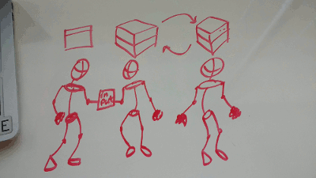

Node Express Roleplay
===

Purpose:
--

Solidify understanding of Front End - Client - Server behaviour through interactivity, role play, and disruption.

Materials:
---

- 2 differently colored papers
- 3 volunteers

Setup:
---
*paper 1*:

- side 1: Input
- side 2: object

*paper 2*:

- side 1: object 
- side 2: output

Process:
---

- ask for 3 volunteers. If you have the conceptual stack drawn on the board, have one stand under Front End (FE), the next under Client, the next under the Server.
- hand *paper 1* tp the FE volunteer with "Input" showing to the class. Note that this represents the user typing in input and clicking a button.
- ask the FE volunteer to pass *paper 1* to the client volunteer keeping "input" facing the class. This represents the client script capturing the input.
- ask the FE Volunteer to flip the page over to show "object" to the class noting that this represents the client script taking the user input and creating an object that is sent to the server.
- after Server Volunteer receives the object make note of it being the req.body.
- Ask the Server Volunteer to put *paper 1* down. Note that this is when the server side logic is happening as the Server Volunteer picks up *paper 2*, with "object" facing the class.
- Ask the server to pass the response (res.send) *paper 2* to the client. At this point the client script has the new object and needs put it on the DOM.
- As the Client Volunteer to flip *paper 2* over and show "output" to the crowd. Then pass it to the Front End Developer.
- Bask in the applause...

