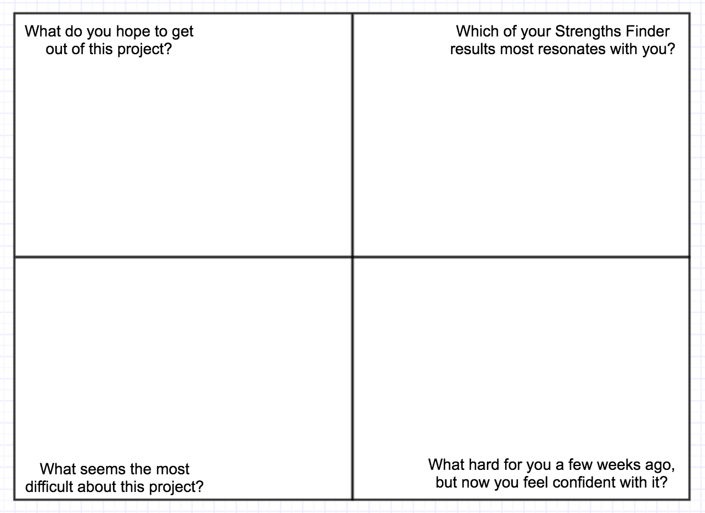
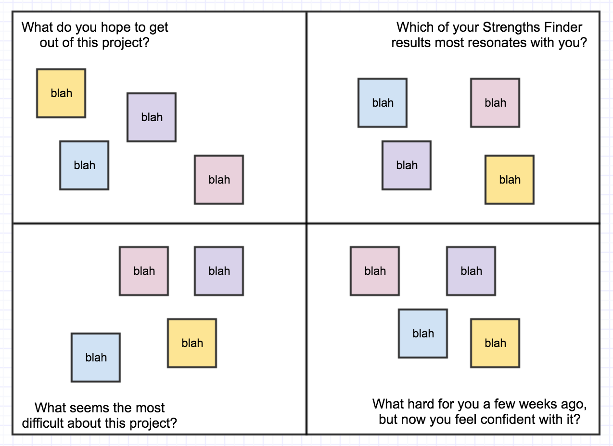
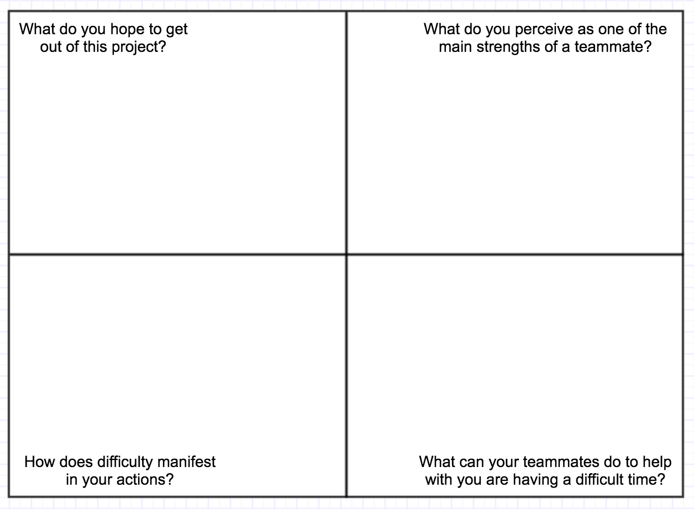
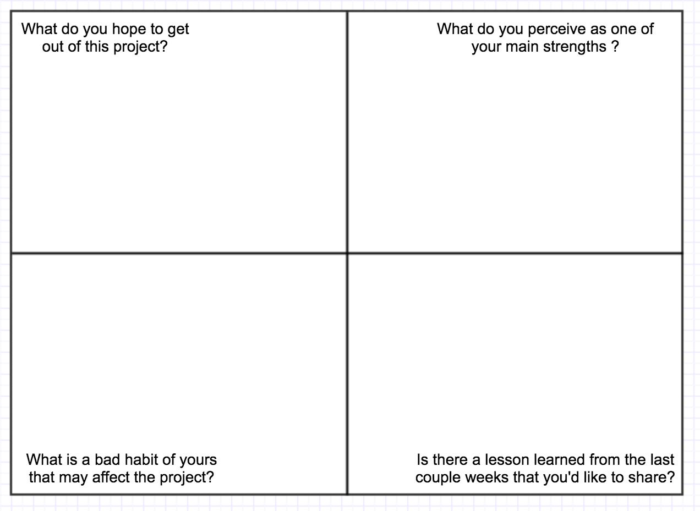

Quads
===

Purpose: 

- Calcify personal/professional growth within the frame of a team & project. 
- Mitigate future team problems by setting expectations
- opportunity for those who are less likey to speak up in a group to share proactively 

Time: 20-30 min 1st time (b/c of demo), 10-10 min each time after.

Description:

Three different versions. First could be rolled out during week 1 on the first group project (Bonus Calculator atm) as it incpororates Strengths Finder data.

1. Each group member receives 4 post it notes. Each group member should have their own color. Make sure each group has a white board.

2. Draw the following example on the main board:

3. Do an example run with you and the other instructor in the room. Reinforce through direct language that this is an  exercise in listening as much as learning.

4. Invite the groups to do the same in their pods. Give a time limit and check in towards the end.

5. Implement a hard stop when time is up and get the groups rolling on the code if needed.

Later...
---

Reintroduce for a later group project in tier 2 with new questions:

And again in tier 3 at the start of group projects. Allow more discussion time for this one.

